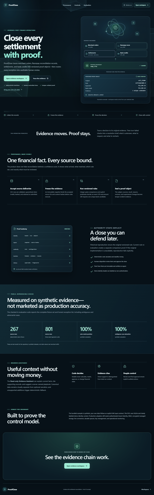
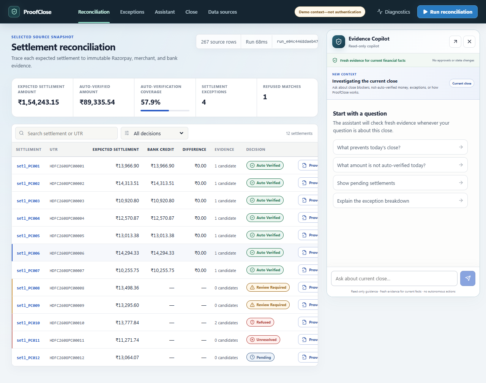
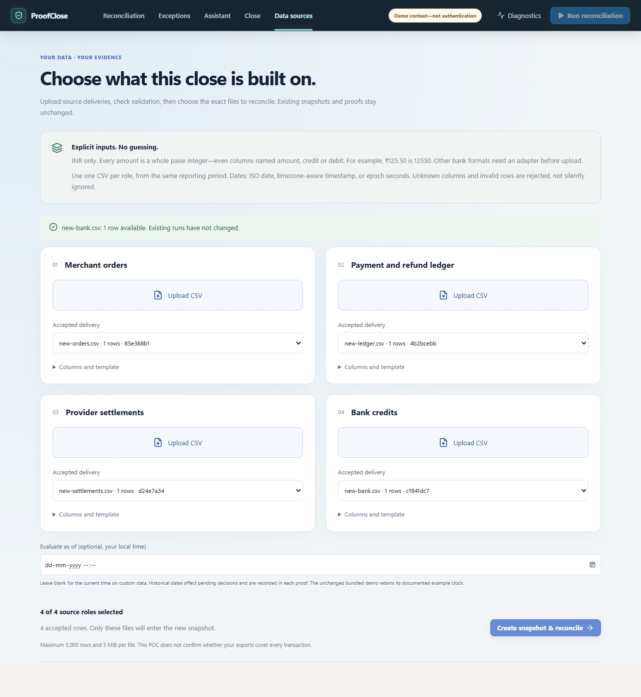
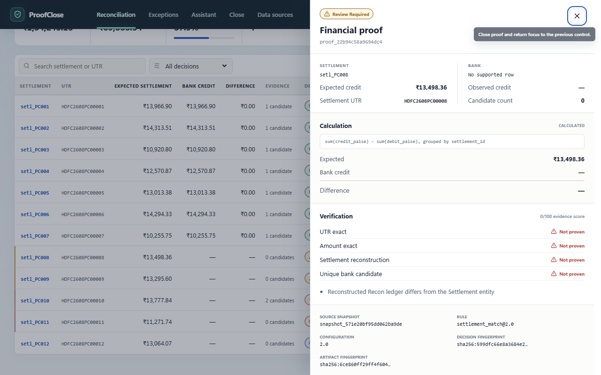
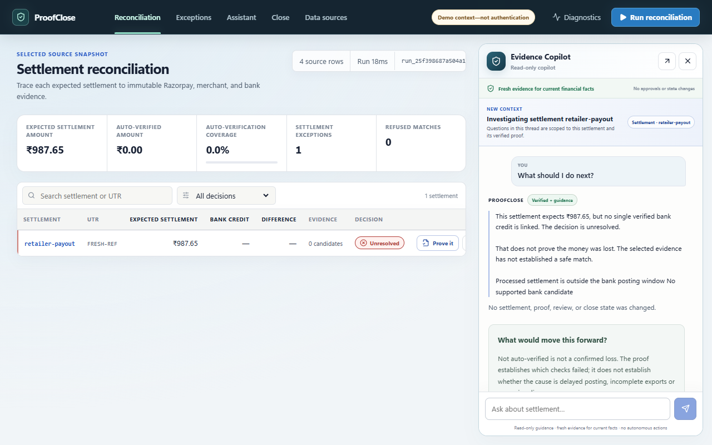
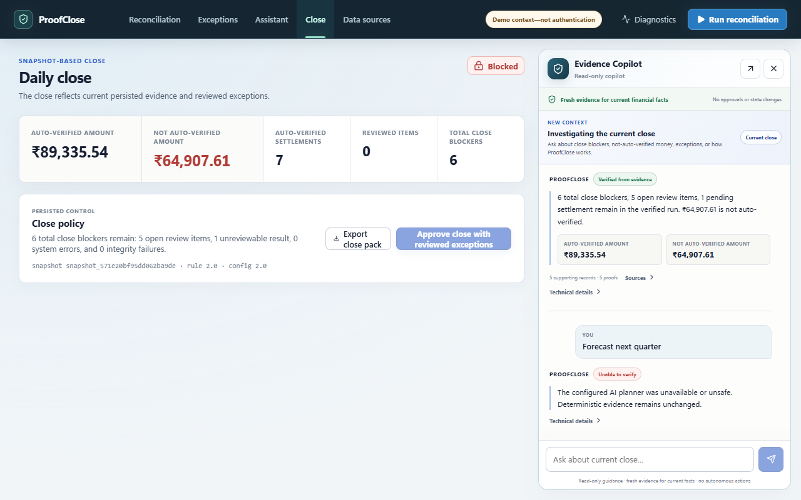

# ProofClose

ProofClose is an evidence-first settlement reconciliation workspace for Razorpay merchants. It turns four ordinary CSV exports into an immutable source snapshot, reconstructs settlements in integer paise, matches bank credits conservatively, and creates a versioned proof for every result.

The rule of the product is simple:

> AI proposes. Code computes. Evidence proves. Policy decides. Humans control review and close.

The complete demo is deterministic and works offline. AI credentials are optional and never control arithmetic, matching, reviews, or close approval. The docked Hybrid Evidence Copilot can talk naturally about concepts, but every statement about the current run is freshly fetched through allowlisted read-only tools. Conversation history helps wording; it is never a source of financial truth.

## Product tour

These are screenshots of the running POC with synthetic demonstration data. Workspace captures use deterministic offline assistance; they are not evidence of live-provider availability. The dark navy-and-mint landing features a rotating 3D proof core, orbiting lights and a mouse-responsive geometric background. The visible motion control pauses or resumes the scene; reduced-motion preferences default to a static view, with an explicit option to enable animation. The image below is a still frame.

### Evidence-first landing



### Reconciliation workspace

Expected money, observed credits, conservative decisions and drill-down proofs in one workspace.



<details>
<summary>Explore CSV ingestion, proofs, the Copilot and human-controlled close</summary>

### Bring your own CSV data

Validate each source delivery, select the four input roles and create a new immutable snapshot.



### Inspect the original evidence

Historical reproduction and current-rule re-evaluation are separate operations.



### From an exception to an evidence request

The read-only Copilot explains the recorded finding, suggests evidence to request and links supporting proofs. A downloadable brief supports a human handoff.



### Human-controlled close

Review status and close blockers stay distinct from the amount that was not automatically verified.



</details>

## Razorpay Buildathon Track 04 fit

The [AI Finance Controller track](https://razorpay.com/buildathon/) asks builders to close a finance-operations loop across more than 50 synthetic records, measure matching, and report the exceptions the system does not resolve. ProofClose completes that loop across merchant orders, Razorpay reconciliation rows, settlement entities, and bank credits:

```text
ingest -> freeze evidence -> reconcile -> refuse ambiguity -> review -> approve -> export Close Pack
```

This is not a chat wrapper around a spreadsheet. Deterministic code owns money and matching; every result gets a tamper-evident Proof Object; a human owns exception disposition and final close approval; the assistant is a read-only evidence interface.

The checked-in offline evaluation processes 801 synthetic source rows across three seeds:

| Measured result | Checked-in result |
|---|---:|
| Automatic matches correct | 21 / 21 (1.000000 precision) |
| Settlements auto-verified | 21 / 36 (0.583333) |
| Expected money auto-verified | ₹2,67,376.42 / ₹4,68,287.54 (0.570966) |
| Expected exceptions detected | 15 / 15 (precision, recall, F1 = 1.000000) |
| Ambiguous cases safely refused | 3 / 3 (1.000000 recall) |
| Required subjects with valid proofs | 39 / 39 |
| Tamper probes detected | 3 / 3 |
| False refusals / duplicate automatic bank allocations | 0 / 0 |

These numbers are synthetic regression evidence, not production accuracy or throughput claims. The complete predictions and honest exception lists are in `evals/results/evaluation_results.json`.

```text
merchant + Razorpay + bank CSVs
              |
       validate and hash
              |
     immutable snapshot
              |
   deterministic L0/L1/L2 rules
              |
       versioned proofs
       /      |       \
exceptions  investigate  close policy
```

## Why this use case matters

Finance teams often spend close day asking three questions: did every payment reach the right settlement, did every settlement reach the bank, and can we prove the answer later? A spreadsheet can calculate totals, but it rarely preserves the exact inputs, rules, and operator decisions that produced an answer. ProofClose makes that evidence the primary product.

An LLM is deliberately not the matcher. A language model can produce plausible but non-repeatable answers, while reconciliation requires exact paise arithmetic, explicit predicates, and safe refusal. ProofClose lets optional AI make evidence easier to ask about; it never lets prose become financial authority.

## Five-minute local demo

Prerequisites: Python 3.12 and Node.js 20 or newer.

```powershell
python -m venv .venv
.\.venv\Scripts\python.exe -m pip install -e ".[dev]"
Set-Location frontend
npm.cmd install
Set-Location ..
```

Start the API:

```powershell
.\.venv\Scripts\python.exe -m uvicorn app.main:app --app-dir backend --host 127.0.0.1 --port 8000
```

In a second terminal, start the UI:

```powershell
Set-Location frontend
npm.cmd run dev -- --host 127.0.0.1
```

Open `http://127.0.0.1:5173` for the provenance-first landing page, then choose **Open evidence workspace**. The operational UI at `/workspace` loads 267 seeded source rows through the same ingestion path as an uploaded file and creates a real run. No account or API key is required.

## What to show a reviewer

1. Landing: follow the visible chain from source records to a frozen snapshot, a versioned Proof Object, and human close.
2. Reconciliation: inspect the settlement table and open a proof.
3. In the proof drawer, compare **Reproduce historical proof** with **Evaluate with current rules**. They are separate operations.
4. Exceptions: show an ambiguous bank match that refuses to guess, plus the planted ledger, missing-credit, multiple-payment, and paise/rupee anomalies. Point out that a settlement exception, a review item, and a total close blocker are deliberately different counts.
5. Evidence Copilot: click **Ask assistant** on two different settlements and notice the visible context divider and separate thread for each one. Ask a general question such as “What is a UTR?”, then ask “What amount is not auto-verified in this run?” The first is general guidance; the second must fetch fresh canonical evidence. Ask “What should I do?” on an exception to see verified facts separated from server-owned read-only guidance.
6. Close: distinguish the **Not auto-verified amount** from **Total close blockers**, then show how reviewed exceptions remain auditable.
7. Diagnostics: inspect measured stage timings, truthful configured/reachable provider states, actual call/token counts, and `unavailable` cost when no versioned pricing configuration exists.

## Bring your own data and resolve an exception

Use **Data sources** in the workspace (or **Bring your own CSV data** on the landing page). Download templates, upload and validate each delivery, choose one file for each role, optionally set a historical evaluation time, then create a new snapshot and run. New data never rewrites old proofs. [Exact input contract and live-integration path](docs/INPUT_CONTRACT.md).

The Copilot now turns failed checks into a **resolution brief**: what is known, what is uncertain, what evidence to request and what must be rechecked. Download the brief for a human handoff; inspect supporting proofs at the bottom of the answer. [How the brief and bounded AI explanations work](docs/RESOLUTION_BRIEFS.md).

## Trust invariants

- Authoritative money is stored and computed as integer paise; floats are rejected.
- Exact UTR and amount only auto-match when there is exactly one bank candidate.
- Raw inputs are hashed, normalized fields retain provenance, and runs bind to immutable snapshots.
- Historical reproduction requires the exact original rule implementation. If it is missing, the operation explicitly returns `RULE_IMPLEMENTATION_UNAVAILABLE`; it never substitutes today's rule.
- Current-rule re-evaluation creates a new linked proof and never edits history.
- `X-Tenant-ID` and `X-Actor-ID` are demo context only. They are not authentication, and production mode rejects them.
- Prompt-like text in uploaded narration is untrusted data and cannot change deterministic decisions.
- The assistant has four visible outcomes: `Verified from evidence`, `Verified + guidance`, `General guidance`, and `Unable to verify`.
- General model prose is allowed only for non-current educational/product help. Current amounts, counts, statuses, identifiers, dates, rules, and configurations require a successful relevant tool result from that request.
- Uploaded narration, raw source text, credentials, provider bodies, hidden prompts, and internal tool instructions are excluded from general-model context. Unsafe output falls back deterministically.
- The assistant has no review, approval, mutation, SQL, or money-movement tool. Recommended actions are server-owned instructions, not executed actions.

## Failure recovery, not happy-path theatre

- Duplicate exact UTR-and-amount candidates are refused instead of guessed.
- Missing or late bank credits become pending or reviewable according to the versioned timing configuration.
- Invalid uploads are rejected or quarantined before they can enter a snapshot.
- A missing historical rule implementation returns `RULE_IMPLEMENTATION_UNAVAILABLE`; current code is never silently substituted.
- Proof or Close Pack mutation fails integrity verification.
- Repeating close approval is idempotent; it returns the same immutable pack instead of producing a second close.
- Provider outage changes only optional narration. Deterministic evidence, review, and close keep working offline.

A concrete refusal is planted in `setl_PC010`: two bank rows share the exact UTR and amount. ProofClose records two candidates and returns `AMBIGUOUS_MATCH` / `REFUSED` instead of selecting one.

## Quality commands

```powershell
.\.venv\Scripts\python.exe -m pytest backend/tests -q
.\.venv\Scripts\python.exe scripts\generate_demo.py
.\.venv\Scripts\python.exe -m evals.runner --seeds 20260831 20260901 20260902 --output evals/results
.\.venv\Scripts\python.exe -m evals.assistant_runner --mode offline --output evals/results
.\.venv\Scripts\python.exe scripts\scan_secrets.py
.\.venv\Scripts\python.exe scripts\verify_screenshots.py
Set-Location frontend
npm.cmd test -- --run
npm.cmd run lint
npm.cmd run typecheck
npm.cmd run build
```

The fixed browser review (`npm.cmd run e2e`, with the backend and frontend running) regenerates the checked-in images in `docs/screenshots`. `scripts/verify_screenshots.py` fails when any required review image is missing or empty, including after a fresh clone.

## Repository map

- `backend/app/domain`: money and immutable domain contracts
- `backend/app/ingestion`, `normalization`: safe input handling and field provenance
- `backend/app/reconciliation`: deterministic Level 0/1/2 rules
- `backend/app/proofs`: fingerprints, version registry, reproduction, and re-evaluation
- `backend/app/investigations`: typed hybrid routing, general-help isolation, allowlisted read-only finance tools, and server-owned guidance
- `backend/app/review`, `close`: human actions, audit, and close policy
- `evals`: seeded ground truth and measured evaluation
- `frontend`: the public provenance landing page and finance-operations workspace

Read [ARCHITECTURE.md](ARCHITECTURE.md), [EVALUATION.md](EVALUATION.md), [SECURITY.md](SECURITY.md), and [LIMITATIONS.md](LIMITATIONS.md) before presenting.

## Prior-work and provenance note

The navigation-plus-drill-down idea was informed by the author's earlier local GreenMind project. ProofClose was implemented as a separate repository for this problem; it does not copy GreenMind credentials or wholesale code, and no other Buildathon submission was used. Synthetic financial records are generated by `scripts/generate_demo.py`; field lineage is described in `docs/PROVENANCE.md`.

## Demo identity warning

The local demo uses fixed tenant and actor context so judges can run it without signup. These headers do not verify a person. A production deployment must replace the dependency in `backend/app/api/context.py` with signed identity claims and role checks. Setting `PROOFCLOSE_ENV=production` causes demo identity headers to be rejected.
